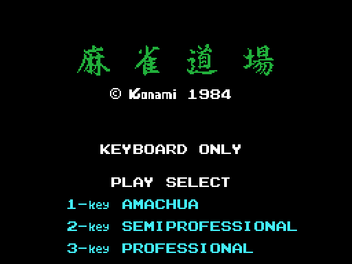
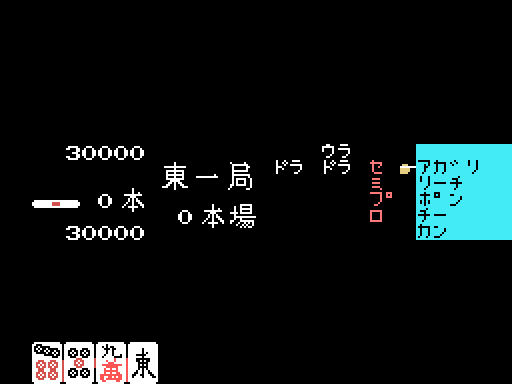
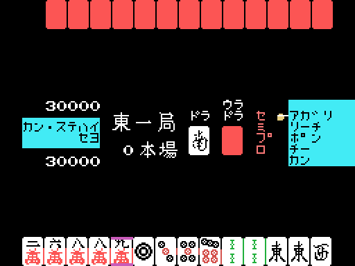
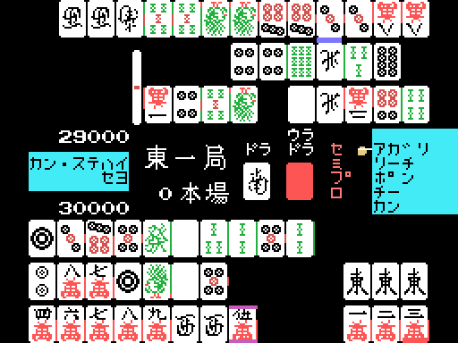
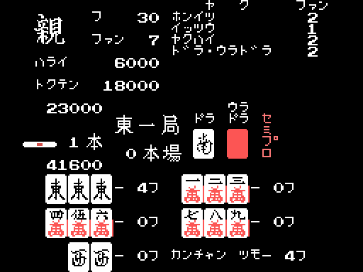
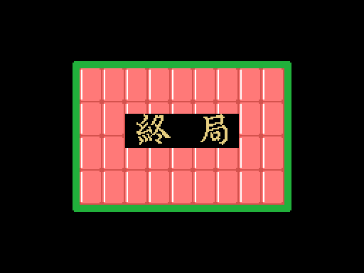

# The game

Konami's Mahjong is a Japanese mahjong **for two players**: you against the
cartridge, head to head, without the other two seats at the table. It is played
on the keyboard only —the title screen says as much— and a game is four dealer
turns: east with player 1 dealing, east with player 2, south with 1 and south
with 2. Each one repeats as long as the dealer keeps winning, so there can be
more than four hands, but never more than four turns.

The title is four kanji, 麻雀道場, *Mahjong Dōjō*. Under it, the copyright
written in the game's own font, and then the menu in ASCII: `KEYBOARD ONLY`,
`PLAY SELECT` and the three difficulties in romaji, `1-key AMACHUA`,
`2-key SEMIPROFESSIONAL` and `3-key PROFESSIONAL`.

That key does not just pick a label. The table at 0x4AE0 turns it into the byte
0xE002 —0x40, 0x60 or 0x50—, and out of its bits 5 and 4 comes 0xE040, which is
the real difficulty. There is a fourth entry, the one for key 4, and it is zero:
it does nothing. What each difficulty changes is in [The
machine](THE-MACHINE.html).

## Fifteen states, and the game is one of them

The whole cartridge is a state machine with two bytes of memory: 0xE000 says
which state it is in and 0xE001 which step inside it. The table at 0x40ED holds
fifteen words, and there is no way out of it.

| state | what happens |
| ---: | --- |
| 0-4 | the startup, the banner coming down and the presentation text |
| **5** | **the title**, with the three-difficulty menu |
| 6-7 | the demo starts |
| **8** | **the difficulty screen**, only reachable by pressing a key |
| 9 | black: the screen is cleared and the playing table drawn |
| 10 | the table is ready, and the deal begins |
| **11** | **the whole hand**, in nine steps |
| 12 | the end of the round |
| 13-14 | 終局, the end of the game |

From 14 it goes back to 0 and starts again. State 11 is where the game lives,
and its nine steps are the deal, the hand, taking the table apart and the
scoring:

| step | what it does |
| ---: | --- |
| 0-1 | the deal, tile by tile |
| **2** | **the hand is played**: draws, discards, calls |
| 3-6 | the hands are turned over and the scoring screen is built |
| **7** | **the scoring**: fu, han, yaku and payment |
| 8 | and on to state 12 |

Step 2 takes nearly all of the time: 103.7 of the 130.3 seconds the demo's hand
lasts.

## The demo does not think: it reads a script

When the cartridge boots and nobody touches anything, a hand is dealt, played
out, scored, and started again. There is no separate demo mode: it **walks the
same state machine a real game does**, through the same routines.

The difference is where the keypresses come from. On entering state 7, 0x416B
hooks the block at 0x4AE8 —**one hundred and four bytes**— up as the keyboard,
and 0x4A68 serves them instead of the matrix for as long as bit 6 of 0xE002 is
clear, which is what tells a demo from a game. The values are the very masks the
real reader builds: bit 0 up, bit 1 down, bit 2 left, bit 3 right, bit 4 space,
bit 5 select. The format is variable length and the low nibble of each entry
decides: at zero, the keypress takes one byte and lasts 64 frames; otherwise it
takes two, and the second says how many times in a row it repeats. The eight
zeros at the end are the script running out.

That is why the demo comes out **the same every time**: two independent cold
boots give the same trace, instant for instant. What is not constant is how long
each lap takes. State 0 comes round again at 5.95, 169.48, 338.44 and 509.00
seconds from power-on, that is laps of **163.53, 168.96 and 170.56 seconds**: the
random seed comes from the memory refresh register R (0x41C6), and with it
changes the hand the machine builds for itself and how long it takes to run out.
Deterministic is not the same as periodic.

## The table

Top and bottom, the two scores: **30,000 points each** to start, in BCD and in
hundreds of a point. In the middle, the wind and hand number (東一局) and the
repeat counter (本場). To their right, the two indicator tiles, one for the dora
and one for the ura-dora; the ura only counts if there is a riichi, but both are
drawn the same. On the left, the counter of riichi sticks left on the table.

The cyan panel on the right is the call menu, and 0x660A fixes its order:
アガリ, リーチ, **ポン, チー**, カン. Each option leaves one bit in 0xE1C7 —1,
2, 4, 8 and 0x10, top to bottom— and 0x663C dispatches the last four.

The opponent's hand goes on top and face down, yours at the bottom and face up.
The deal is animated in batches, and each one runs at its own pace —every 32,
every 16 or every 4 frames— because what you are watching is the animation: the
thirteen tiles are already dealt before the first one is drawn.

## The turn

A turn is split into eight phases, each one a bit of 0xE1AA. The one that
matters is phase 1, choosing the discard, and that is where the difficulties
part ways: on the first there is no clock and you have to press a key to draw,
while on the second and the third a timer runs that warns with a sound at 420
frames and discards on its own at 600, whichever tile the cursor is on.

The first difficulty also has a helping hand the other two do not: 0x49C6 will
not let you discard one of your own waits while in riichi, and it warns you when
the opponent's discard gives you a ron.

## The scoring

When somebody calls, the hand stops and step 7 builds the count on screen, in
the order it is worked out: first the sets with their fu, one every 64 frames;
then the wait and the base fu; the sum; the total rounded up to the next ten;
and finally the names of the yaku, one per call, with the payment behind them.

Top left is who wins —親 if it is the dealer—, フ and ファン are the fu and the
han, ハライ what the loser pays and トクテン what the winner takes. On the
right, the list of yaku with their value in han. Below, the hand split into
sets, with the fu of each one and the kind of wait.

That ハライ and トクテン do not match is **not a misreading**: with tsumo they
are two different figures on purpose, and that is covered in [The
rules](THE-RULES.html).

The points do not jump from one figure to another either: they move a hundred at
a time, one per frame, with their sound.

## The ending

The game ends when the non-dealer wins the last turn, and then the closing
sequence builds a wall of tiles and writes 終局 across it, *shūkyoku*, the end
of the game. Some nine seconds later it goes back to the title.
