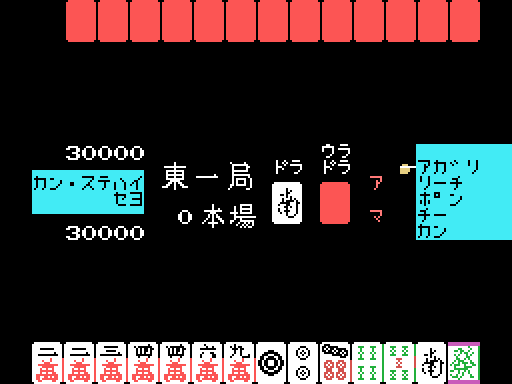

# The machine

The opponent in this cartridge plays well. It declares riichi, calls pon and
chi, defends itself when it is losing and wins expensive hands. What it does not
do is **think**: it never evaluates its hand, never works out waits to decide
what to throw, and has nothing resembling a search. What it has is a very well
built stage set, and all of it is in the code.

## Its hand is not drawn: it is built

Before anything is dealt, 0x78CE assembles fourteen tiles to order following a
plan it keeps in 0xE058: it picks a suit, a target for how many tiles go in
triplets, and fills the rest with runs of that suit or with pairs, leaving a pair
at the end. Then it **takes one away** (0x7A93).

Which means the machine starts every hand **one single tile short of
completing it**. And it is not an invisible shortcut: the copies it spends are
deducted from the counters at 0xE186, so the player can no longer draw them.

The plan is decided by the machine's own score —one branch when it is in the
red, another below 10,000—, by the honba and by several random draws. On the
third difficulty, the missing tile is always the one at index 11.

## Nor does it discard from its hand

Its thirteen tiles do not move for the whole hand. The tile it draws each turn
always lands in the same slot (0xE208), and **what goes into its river is a tile
drawn at random**, not one from its hand (0x583C).

That draw goes through a filter that makes it look like a human discard. On
difficulties 2 and 3:

- the **first four** discards are honours, and nothing but honours;
- the **next four** are ones, twos, eights and nines; from the ninth on
  anything goes;
- never one of its own waits, until its riichi turn comes round;
- if the plan is going for a suit, never one of that suit;
- and from discard 12 on, when not defending, not the suit the player has
  discarded least either, which 0x58D6 works out by counting their river.

Every rejected candidate goes back into the pile and another is drawn. On the
first difficulty there is no filter: whatever comes out, goes out.

It is exactly the order a person discards in —first what is no use, then the
extremes, the middle last— arrived at without looking at the hand even once.

### The mistake at 0x595C

Next to the suit filter there is another one meant to avoid throwing terminals,
and it is written wrong. It compares the tile's number with 1 and, if it is not a
1, returns; and if it is, it compares that same 1 with 9, which does not match
either, and returns just the same:

    595C:  ld a,(0E22Bh)      ; the candidate
    595F:  and 0Fh            ; its number
    5961:  cp 1
    5963:  jr nz,5987         ; not a 1 -> accepted
    5965:  cp 9               ; A is 1: it is never 9
    5967:  jr nz,5987         ; -> accepted anyway
    5969:  call ...           ; put it back and draw another:
    596C:  call ...           ; THREE instructions that never run

The three instructions below are perfectly well formed and **never execute**. It
barely shows, because the filter on the four discards from the fifth to the
eighth already pushes towards the extremes by another route.

## The empty slot in its hand is theatre

When the opponent's face-down hand is drawn, one of the tiles is shown as a gap
so you can see where it has just drawn. Which one gets picked is decided by
0x553C: in riichi, and past a certain discard, always the drawn tile's slot;
before that, **either at random or the drawn tile's, depending on bit 0 of the
seed**.

There is nothing behind it. The information that gap seems to give you —"it has
just drawn and kept that one"— is false half the time.

## It does not win when it can, it wins when it is due

The machine has a discard number marked (0xE33D) before which it **will not
call**, even holding the hand (0x567B). With ron it lets the tile go by; with
tsumo it draws another tile that is not one of its waits. It will not win on its
riichi turn either.

And when it finally does call, it demands it be worth it: 2 han or more, or 1 if
there are fewer than 5 honba.

It declares riichi **exactly on discard number 0xE1BB**, which is built by adding
to a random draw an amount that depends on the key: 3 on the first difficulty, 5
on the second and 7 on the third. And bit 0 of the seed decides whether that sum
happens at all, so half the time the difficulty does not count.

## The defence

On discard 15, if the player is in riichi with waits and one of three conditions
holds —that the opponent's riichi turn falls on 15 or later, that the player has
thrown fewer than two honours or terminals, or that the plan has none of the high
bits— the machine goes into defence. Also on discard 18, if the seed is even.

In defence its whole behaviour changes: it does not win, it does not declare
riichi, and for the first time it **really does discard a tile from its hand**,
picking one that is already in the player's river, which by furiten cannot give
them a ron. The gap that leaves is filled with a randomly drawn tile.

## The three difficulties, side by side

| | 1 · AMACHUA | 2 · SEMIPROFESSIONAL | 3 · PROFESSIONAL |
| --- | --- | --- | --- |
| furiten ron | refused, no penalty | 12,000 / 8,000 penalty | 12,000 / 8,000 penalty |
| riichi furiten | none | yes | yes |
| discard clock | none | 10 s, warning at 7 | 10 s, warning at 7 |
| help for the player | yes: warns of a ron and blocks discarding your own wait in riichi | no | no |
| opponent's discards | unfiltered | filtered | filtered |
| opponent's riichi turn | draw + 3 | draw + 5 | draw + 7 |
| the built hand | — | — | always missing tile 11 |
| the 0xE33D draw | first one accepted | first one accepted | redrawn if it comes out 20 or more |

And you do not need to remember which key you pressed: the top bar labels it for
the whole game, with a different list for each difficulty (0x4CB8).
